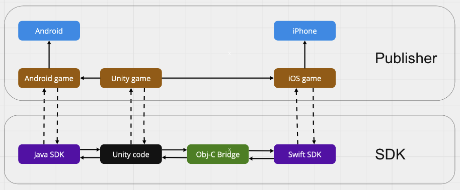

# YabbiAds - Unity документация

## Оглавление
* [Системные требования](#системные-требования)
* [Установка](#установка)
* [Info.plist](#Info.plist)
* [Схема работы](#схема-работы)
* [Общая схема взаимодействия](#общая-схема-взаимодействия)
* [Использование](#использование)
* [SDK API](#sdk-api)
  * [AdEvents](#adevents)
  * [YabbyAdsException](#yabbiadsexception)
  * [InterstitialAdContainer](#interstitialadcontainer)
    * [Конструктор](#конструктор)
    * [Метод load](#метод-load)
    * [Метод show](#метод-show)
    * [Геттер isLoaded](#геттер-isloaded)
    * [Метод setAlwaysRequestLocation](#метод-setAlwaysRequestLocation)
  * [VideoAdContainer](#videoadcontainer)

## Системные требования
iOS 12+.

## Установка
Добавляем в наш проект YabbiSdk.unitypackage в папке Assets/Plugins/iOS

## Info.plist
Необходимо добавить описание для ключей в Info.plist
* NSUserTrackingUsageDescription - для определния идентификатора устройства(ifa)
* NSLocationWhenInUseUsageDescription - для геопозиции

## Схема работы


## Общая схема взаимодействия
В приложениях креативы показываются в вебвью элементе. Для работы с iOS, C# обращается к публичным функциям, помеченным аннотацией `@_cdelcl`.    
Аннотация говорит о том, что функции доступны на Objective-C.  
Через них идет обращение к приватному Singleton-классу, который отвечает за взаимодействие с нативной SDK на Swift.   
Примечание: Тестировать показ рекламы можно только в собранном iOS приложении. В Unity Editor будет выброшена ошибка среды.

Цепочка взаимодействия:
1. Пользователь создает аккаунт (или редактирует уже имеющийся) и добавляет сове приложение в свой аккаунт;
2. Пользователь вызывает метод инициализации в SDK, передавая свой идентификатор пользователя, полученный из веб интерфейса bestssp;
3. Пользователь вызывает метод загрузки креатива, передавая идентификатор своего приложения, формат будущего показа;
4. Пользователь вызывает метод показа уже загруженного креатива. В этот момент происходит показ баннера.

## Использование
Для использования вам потребуется получить идентификатор издателя и идентификатор размещения, они выдаются в личном кабинете пользователя.  
Пример использования показа полноэкранной баннерной рекламы показан ниже. _([VideoAdContainer](#videoadcontainer) используется аналогично, просто замените InterstitialAdContainer на VideoAdContainer в коде ниже.)_  
Необходимо заменить YOUR_PUBLISHER_ID на ваш идентификатор издателя и YOUR_UNIT_ID на ваш идентификатор размещения.

```C#
using Me.Yabbi.Ads;

private InterstitialAdContainer interstitialAdContainer;


private const string pubId = YOUR_PUBLISHER_ID;

void Start()
{
    interstitialAdContainer = new InterstitialAdContainer(pubId, YOUR_UNIT_ID);

}

public void StartInterstitialBanner()
{
     interstitialAdContainer.Load(new AutoShowAdEvents(interstitialAdContainer));
}


public class AutoShowAdEvents : IAdEvents {
    BaseAdContainer container;

    public AutoShowAdEvents(BaseAdContainer adContainer){
        container = adContainer;
    }
     public void onLoad(){
        container.Show();
    }
     public void onFail(string error){
        Debug.Log(error);
    }
     public void onShow(){
        Debug.Log("onShow");
    }
     public void onClose(){
        Debug.Log("onClose");
        container.Dispose();
    }
     public void onComplete(){
        Debug.Log("onComplete");
    }
}
  
```

## SDK API

### AdEvents:
Протокол AdEvents используется для получения callback-ов о взаимодействии с рекламой. Необходимо создать унаследованный от него класс.

void onLoad() //метод вызывается когда рекламный контент был успешно загружен
void onFail(error:String) //вызывается при происхождении ошибки препятствующей загрузке рекламы
void onShow() //вызывается в момент показа рекламы пользователю
void onComplete() //вызывается в VideoAdContainer в момент окончания видео, в случае rewarded типа видео можно награждать пользователя по этому событию
void onClose() //вызывается при закрытии пользователем рекламного окна


### YabbiAdsException:
Класс YabbiAdsException используется для выброски исключений связанных с SDK.

### InterstitialAdContainer:
Класс InterstitialAdContainer используется для показа "промежуточной" (межэкранной) рекламы в виде фуллскрин баннера.  
Примечание: В дальнейшем инстанс можно переиспользовать, если вызвать load после закрытия предыдущей рекламы.

#### Конструктор:
Параметры:  
publisherId -- ID паблишера, который был получен в личном кабинете  
unitId -- ID рекламного юнита, получается в личном кабинете  
controller -- UIViewController через которого будет вызываться показ баннерной рекламы. Если controller == nil то подставляется top-controller(активный сейчас)

InterstitialAdContainer(publisherId: publisherId, unitId:unitId, controller: controller)


#### Метод load:
Инициирует загрузку рекламы.  
Когда реклама будет загружена вызовется колбек adEvents.onLoad().  
При ошибке вызовет колбек adEvents.onFail(error:String).  
По умолчанию контейнер запрашивает доступ к геолокации во время вызова этого метода, при помощи метода [setAlwaysRequestLocation](#метод-setAlwaysRequestLocation) данный функционал можно отключить.   
Начиная с iOS 14.5 контейнер запрашивает разрешение на "отслеживание активности в приложениях других компаний", нужно получить разрешение пользователя, что идентифицировать его рекламный идентификатор.

void load(adEvents: AdEvents)


#### Метод show:
Вызывает показ рекламного баннера пользователю, при показе вызовется колбек adEvents.onShow().  
Может выбросить исключение если попытаться показать рекламу которая не была загружена.  
Также выбрасывает исключение при попытке повторного показа одной и той же рекламы.  
Когда пользователь закроет рекламу будет вызван колбек adEvents.onClose().  

void show()


#### Геттер isLoaded:
Проверяет была-ли загружена реклама

isLoaded: Bool


#### Метод setAlwaysRequestLocation:
Позволяет включить/отключить функционал автоматического запроса разрешения на доступ к гео функциям.

void setAlwaysRequestLocation(isEnabled: Bool)

#### Dispose:
Позволяет уничтожить инстанс рекламного конейтера, для освобождения памяти.
Примечание: После вызова метода, объект нельзя переиспользовать.

### VideoAdContainer:
Класс VideoAdContainer используется для показа fullscreen video (полноэкранного видео) и fullscreen rewarded video (полноэкранное награждаемое видео).  
Тип показываемого рекламного видео (награждаемое/обычное) определяется исходят из unitID, которое было получено в административной панели при настройке рекламного места в инвентаре, поэтому уделите особое внимание выбору типа рекламного места и убедитесь, что оно выбранно именно такое какое вам нужно.  
В остальном использование контейнера (и особенности поведения) схоже с использованием [InterstitialAdContainer](#interstitialadcontainer), см. главу [Использование](#использование).  
Вознаграждаемое видео отличается тем, что закрытие видео возможно только после его полного просмотра, либо в случае ошибки. Награждать пользователя можно по происхождению события adEvents.onComplete.  
Примечание: В дальнейшем инстанс можно переиспользовать, если вызвать load после закрытия предыдущей рекламы.